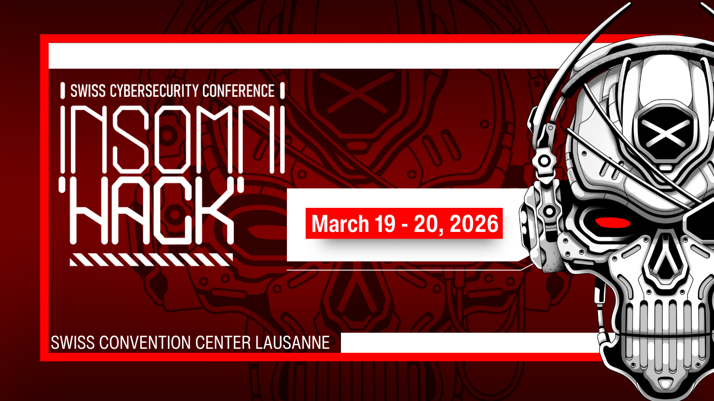
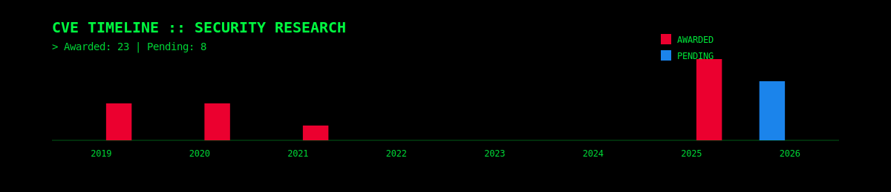
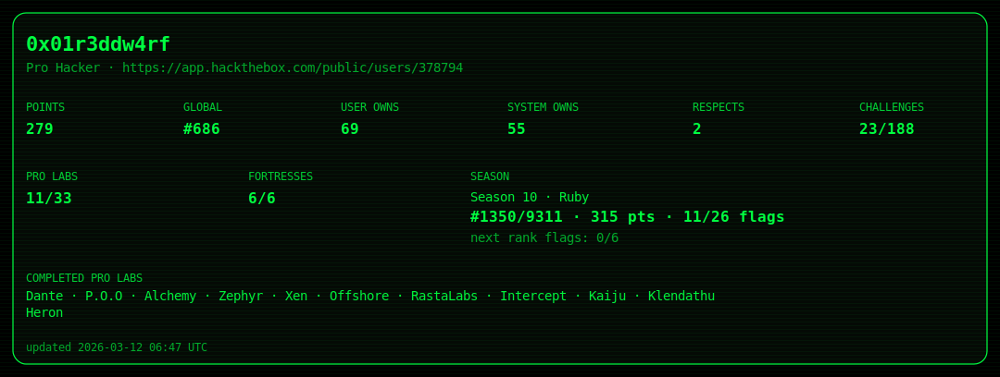

# 👋 Hi, I’m Georg (aka 0x01r3ddw4rf)

Senior Offensive Security Consultant specializing in offensive security engineering, advanced penetration testing, and vulnerability research.
I focus on real-world exploitation, responsible disclosure, and building practical security tooling that strengthens enterprise environments.

<!-- 🌍 Where to Meet Me Next-->

  <h2>📍 Meet me next</h2>

  

  <h3>
    # 🇨🇭 Insomni'hack — Lausanne (March 2026)  
    March
  </h3>

  

  

## 🗓 Upcoming Events

<table>
<tr>
<td valign="top">

### 🎤 Speaking

| Event | Location | Date |
|-------|----------|------|
| Insomni'hack | Lausanne 🇨🇭 | March 2026 |
| BSides Berlin | Berlin 🇩🇪 | TBD |

</td>

<td width="60"></td>

<td valign="top">

### 🤝 Attending

| Event | Location | Date |
|-------|----------|------|
| BSides Munich | Munich 🇩🇪 | 2026 |
| Black Hat Europe | London 🇬🇧 | TBD |

</td>
</tr>
</table>

  

  

---

## 🚀 About Me

- 🔐 **Role:** Senior Offensive Security Consultant  
- 🧠 **Focus Areas:** Offensive Security, Exploit Development, Vulnerability Research  
- 🏢 **Company:** Lufthansa Industry Solutions  
- 🌍 **Location:** Hamburg, Germany  
- ☕ Coffee enthusiast & continuous learner  

---

## 🛠 Technical Expertise

### Offensive Security
- Network & Infrastructure Assessments  
- Red Teaming & Active Direcotry
- Web Application Penetration Testing 
- Purple Teaming  
- Vulnerability Discovery & Responsible Disclosure  

### Development & Tooling
- Python automation for security testing  
- Bash scripting  
- Custom exploit PoCs  
- Lab & containerized test environments

## 🛡 CVE Contributions

**Full list:** https://github.com/gpheheise/All-Awareded-CVE-List

---

## 🧩 Hack The Box

---

## 🎤 Talks & Conference Presence
I’ve presented research and technical work across multiple security communities and events — from offensive security topics to vulnerability research and real-world findings.  
If you’re organizing a meetup or conference, I’m open to speaking opportunities.

### 🟣 BSides Dresden (2025)  
**The AI Ad Apocalypse — Unmasking YouTube Ads That Drain macOS Crypto Wallets**

▶️ Full recording available on YouTube

### 🔴 BSides Tirana (2025)  
**Breaking Bad AD — What Red Teams Wish You'd Fix Yesterday**

*(Recording coming soon)*

  
  

---

## 🔬 Research & Publications

I regularly publish technical research, security findings, and deep dives:

- ✍ **Medium (Research Write-ups & Technical Articles)**  
  👉 https://medium.com/@gpheheise  

- 📄 **LinkedIn Articles (Security Research & Professional Publications)**  
  👉 https://www.linkedin.com/in/georgpheheise/recent-activity/articles/

These publications cover vulnerability analysis, exploitation concepts, practical security assessments, and lessons learned from offensive security engagements.

---

## 🛠 Technical Expertise

### Offensive Security
- Network & Infrastructure Assessments  
- Red Teaming & Active Direcotry
- Web Application Penetration Testing 
- Purple Teaming  
- Vulnerability Discovery & Responsible Disclosure  

### Development & Tooling
- Python automation for security testing  
- Bash scripting  
- Custom exploit PoCs  
- Lab & containerized test environments

## 📂 What You’ll Find on This GitHub

- 🔍 Security research projects  
- 🧪 Exploit Proof-of-Concept implementations  
- 🛠 Custom penetration testing tooling  
- 📚 Lab environments and security experiments  

---

## 📬 Connect

---

> Passionate about improving security through research, transparency, and practical knowledge sharing.
